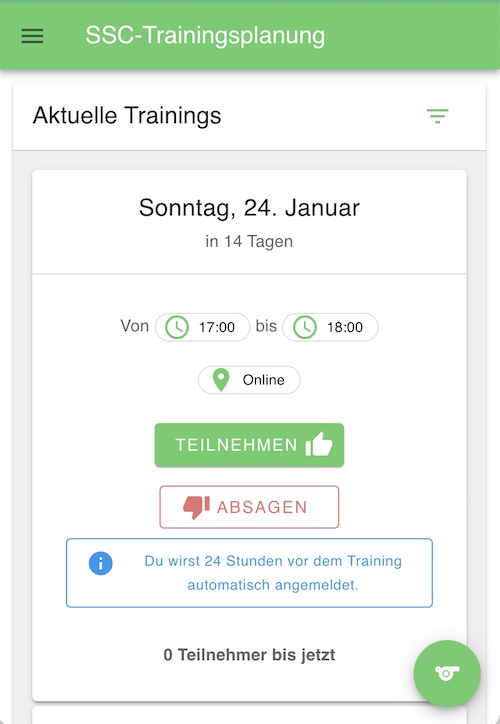
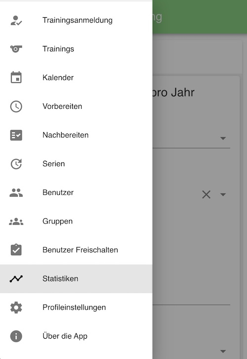
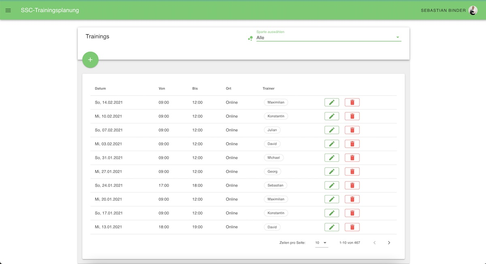

# T.O.M.E. - Training Organization Made Easy

A monorepo PWA to organize training sessions for sport clubs with a decoupled Vue.js frontend and Laravel REST API backend.

**Main goals:**
- Support the work of trainers
- Make the attendance process for users as easy as possible (no account registration needed)

## Screenshots





## Quick Start

### Option 1: Docker (Recommended - Production-like)
Best for testing the full integrated stack with nginx proxy.

```bash
# Build and start all services (nginx, laravel, mysql)
docker-compose up -d

# Run Laravel migrations
docker-compose exec laravel php artisan migrate
docker-compose exec laravel php artisan db:seed

# Build frontend and copy to public folder
cd app && npm run build:serve

# Access at http://localhost:8000
```

**Features:**
- ✅ Nginx reverse proxy handles routing
- ✅ Same-origin cookies work (SameSite=Strict)
- ✅ MySQL database included
- ✅ Production-like environment

Stop with: `docker-compose down`

### Option 2: Local Development (Vite + Local Laravel)
Best for rapid development with hot reload.

```bash
# Terminal 1: Start Laravel backend
cd server && composer install && php artisan serve
# Runs on http://localhost:8000

# Terminal 2: Start Vite dev server
cd app && npm install && npm run dev
# Runs on http://localhost:5173 with hot reload

# Terminal 3: (Optional) Configure Laravel
php artisan migrate
php artisan db:seed
```

**Features:**
- ✅ Hot module reload for frontend changes
- ✅ Separate dev servers (no nginx needed)
- ✅ Vite proxy to /api/* endpoints
- ✅ SameSite=Lax cookies work with different ports

Access: `http://localhost:5173`

## Technologies

### Frontend
- **Vue 3.4** (framework)
- **Vite 5.2** (bundler & dev server)
- **Vuetify 3.5** (Material Design components)
- **Pinia 2.1** (state management)
- **Vue Router 4.3** (routing with guards)
- **Firebase 10** (push notifications)
- **ApexCharts** (data visualization)
- **Moment.js** (date/time utilities)

### Backend
- **Laravel 8** with REST API
- **Dingo API v3** (`/api/v1/` endpoints)
- **JWT** authentication (tymon/jwt-auth)
- **Spatie Permissions** (roles & permissions)
- **Firebase Cloud Messaging** (push notifications)
- **Zoom Integration** (laravel-zoom)
- **Excel Export** (maatwebsite/excel)

## Development Commands

### Frontend (`/app`)
```bash
npm install              # Install dependencies
npm run dev             # Vite dev server (port 5173, hot reload)
npm run build           # Production build to /dist
npm run build:serve     # Build + copy to /server/public
npm run deploy          # Copy dist/ to /server/public
npm run lint            # ESLint with auto-fix
```

### Backend (`/server`)
```bash
composer install              # Install dependencies
php artisan serve             # Dev server (port 8000)
php artisan migrate           # Run migrations
php artisan db:seed           # Seed database
php artisan jwt:secret -f     # Generate JWT secret
phpunit                       # Run tests
```

## Architecture

### Key Models
- **Training** (core entity) → has many TrainingParticipation, TrainingTrainer; belongs to many Group, Content
- **User** roles/permissions via Spatie
- **Branch**, **Group**, **Location**, **Trainer**, **TrainingContent**

### Authentication
Users authenticate with JWT stored in **HttpOnly cookies** (set by LoginController). The browser automatically sends the cookie with all same-origin requests. The `JwtFromCookie` middleware extracts the token for API routes. 401 responses trigger automatic token refresh via the Axios response interceptor.

### Key Notes
- API responses are camelCase (automatic via `laravel-camelcase-json`)
- Trainings use soft deletes—check for `markedForDeletion` flags
- Unregistered users (cookie auth) can check in/out without a registered account

## Configuration

### Frontend `.env.local` (Optional)
```
# Override API URL (defaults to /api/v1)
VITE_APP_API_URL=http://localhost:8000/api/v1
```

### Backend `.env` (Key Variables)
```
DB_HOST / DB_PORT / DB_DATABASE / DB_USERNAME / DB_PASSWORD
JWT_SECRET          # Generate with: php artisan jwt:secret -f
FCM_SERVER_KEY / FCM_SENDER_ID   # Firebase push notifications
MAIL_*              # Email config for password reset + monthly stats
```


